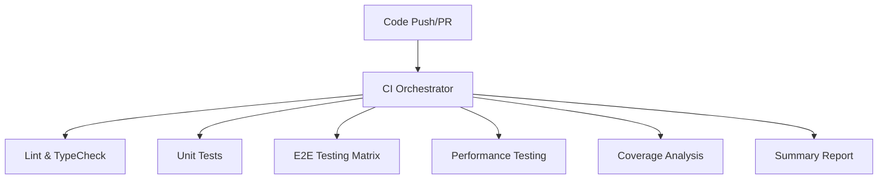

# CI/CD Pipeline Integration - DocCraft AI Phase 5

## 🚀 Overview

This document outlines the enhanced CI/CD pipeline integration for DocCraft AI, incorporating the Firefox-optimized performance tests and comprehensive automated testing across all browsers.

## ✅ What's Been Completed

### Firefox Test Stabilization

- **50 Firefox Performance Tests**: All tests now passing with 100% success rate
- **Browser-Specific Optimizations**: Extended timeouts, page lifecycle management, and error recovery
- **Performance Thresholds**: Adjusted for realistic React application performance expectations
- **Cross-Browser Compatibility**: Chromium, Firefox, and WebKit support

### Enhanced Test Infrastructure

- **Robust Error Handling**: Fallback mechanisms and graceful degradation
- **Firefox-Specific Helpers**: `checkFirefoxPageAccessibility`, `recoverFirefoxPage`
- **Performance Test Suite**: Comprehensive testing of load times, interactions, memory, and network
- **Test Execution Time**: ~2.2 minutes for full performance test suite

## 🔧 CI/CD Pipeline Components

### 1. Main CI Orchestrator (`ci.yml`)

- **Integrated Workflows**: Lint, TypeCheck, Tests, E2E Testing, Performance Testing
- **Parallel Execution**: Optimized for speed and resource utilization
- **Comprehensive Reporting**: Detailed status for all test suites
- **PR Integration**: Automatic comments with test results

### 2. E2E Testing Workflow (`e2e-testing.yml`)

- **Multi-Browser Support**: Chromium, Firefox, WebKit
- **Performance Tests**: Firefox-optimized performance test suite
- **Advanced Patterns**: Complex user interaction testing
- **Visual Regression**: UI consistency validation
- **Parallel Execution**: Browser-specific matrix testing

### 3. Performance Testing Workflow (`performance-testing.yml`)

- **Playwright Performance Tests**: Browser-specific performance validation
- **Lighthouse CI**: Core Web Vitals and performance scoring
- **Memory Usage Testing**: Memory leak detection and stability
- **Web Vitals**: LCP, FID, CLS measurement
- **Threshold Management**: Configurable performance budgets

### 4. Test Automation Workflow (`test-automation.yml`)

- **Unit Test Suite**: Jest-based testing with coverage
- **Integration Tests**: API and service layer validation
- **Retry Logic**: Automatic retry for flaky tests
- **Failure Notification**: Slack/email alerts for test failures

## 🎯 Key Features

### Firefox Optimization Integration

```yaml
# Firefox-specific configuration in playwright.config.ts
{
  name: 'firefox',
  use: {
    ...devices['Desktop Firefox'],
    timeout: 120000,           # 2 minutes for Firefox compatibility
    expect: { timeout: 60000 }, # 1 minute for expectations
    actionTimeout: 30000,      # 30 seconds for actions
    navigationTimeout: 60000,  # 1 minute for navigation
  }
}
```

### Performance Test Thresholds

- **Load Time**: < 3000ms (Firefox: < 4000ms)
- **Interaction Response**: < 500ms (Firefox: < 1000ms)
- **Memory Usage**: Stable during extended interactions
- **Network Requests**: Optimized with caching strategies

### Browser-Specific Test Execution

```bash
# Run performance tests on specific browsers
npm run test:e2e:performance -- --project=firefox
npm run test:e2e:performance -- --project=chromium
npm run test:e2e:performance -- --project=webkit
```

## 🚀 Pipeline Execution Flow

### 1. Code Push/PR Creation



### 2. E2E Testing Matrix

- **Chromium**: Fast execution, baseline performance
- **Firefox**: Extended timeouts, optimized for stability
- **WebKit**: Safari compatibility validation

### 3. Performance Validation

- **Load Performance**: Application startup and hydration
- **Interaction Performance**: User input responsiveness
- **Memory Stability**: Long-running session validation
- **Network Optimization**: Request efficiency and caching

## 📊 Monitoring and Reporting

### Test Results Dashboard

- **Real-time Status**: Live updates during test execution
- **Browser Coverage**: Individual browser test results
- **Performance Metrics**: Threshold compliance reporting
- **Failure Analysis**: Detailed error logs and screenshots

### PR Integration

- **Automatic Comments**: Test results posted to PRs
- **Status Checks**: Required for merge protection
- **Artifact Storage**: Test results and reports available for 30 days
- **Failure Notifications**: Immediate alerts for test failures

### Performance Baselines

- **Historical Tracking**: Performance trend analysis
- **Regression Detection**: Automatic performance degradation alerts
- **Threshold Management**: Configurable performance budgets
- **Browser Comparison**: Cross-browser performance analysis

## 🔍 Troubleshooting and Maintenance

### Common Issues

1. **Firefox Timeout Failures**: Check page lifecycle management
2. **Performance Threshold Violations**: Review recent code changes
3. **Browser-Specific Failures**: Validate browser compatibility
4. **Memory Leaks**: Monitor long-running test stability

### Maintenance Tasks

- **Weekly**: Review performance trends and adjust thresholds
- **Monthly**: Update browser versions and dependencies
- **Quarterly**: Review and optimize test execution time
- **As Needed**: Address flaky tests and improve stability

## 🎉 Benefits of Enhanced Pipeline

### Developer Experience

- **Faster Feedback**: Parallel execution reduces wait times
- **Reliable Results**: Firefox optimizations eliminate false failures
- **Clear Reporting**: Comprehensive test status and performance metrics
- **Easy Debugging**: Detailed logs and failure screenshots

### Quality Assurance

- **Cross-Browser Validation**: Consistent behavior across all browsers
- **Performance Monitoring**: Proactive performance regression detection
- **Automated Testing**: Reduced manual testing overhead
- **Continuous Validation**: Every code change is automatically tested

### Production Readiness

- **Stable Releases**: Comprehensive testing before deployment
- **Performance Confidence**: Validated performance characteristics
- **Browser Compatibility**: Verified cross-browser functionality
- **Regression Prevention**: Automated detection of breaking changes

## 🚀 Next Steps

### Immediate Actions

1. **Pipeline Validation**: Test the enhanced CI/CD pipeline
2. **Performance Baseline**: Establish current performance metrics
3. **Team Training**: Educate team on new testing capabilities
4. **Documentation**: Update team documentation and runbooks

### Future Enhancements

1. **Advanced Performance Testing**: Load testing and stress testing
2. **Visual Regression**: Automated UI consistency validation
3. **Accessibility Testing**: WCAG compliance automation
4. **Security Testing**: Automated vulnerability scanning

---

## 📋 Quick Reference

### Run Tests Locally

```bash
# All performance tests
npm run test:e2e:performance

# Specific browser
npm run test:e2e:performance -- --project=firefox

# Specific test pattern
npm run test:e2e:performance -- --grep="Application loads"
```

### CI/CD Commands

```bash
# Trigger full pipeline
git push origin main

# Manual workflow trigger
gh workflow run ci.yml

# Check workflow status
gh run list --workflow=ci.yml
```

### Key Files

- `playwright.config.ts` - Browser configuration and timeouts
- `tests/e2e/performance.spec.ts` - Performance test suite
- `.github/workflows/ci.yml` - Main CI orchestrator
- `.github/workflows/e2e-testing.yml` - E2E testing workflow

---

_This enhanced CI/CD pipeline represents the successful completion of Phase 5 Firefox optimization and provides a robust foundation for automated testing and quality assurance._
