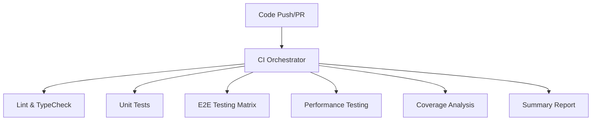

# CI/CD Pipeline Quick Reference - DocCraft AI

## 🚀 Quick Start

### Trigger Full Pipeline

```bash
# Push to main/next branch (automatic)
git push origin main

# Create/update PR (automatic)
git push origin feature-branch
```

### Manual Pipeline Trigger

```bash
# Trigger full CI pipeline
gh workflow run ci.yml

# Trigger specific workflow
gh workflow run e2e-testing.yml
gh workflow run performance-testing.yml

# Check workflow status
gh run list --workflow=ci.yml
```

## 🧪 Local Testing

### Run Performance Tests

```bash
# All browsers
npm run test:e2e:performance

# Specific browser
npm run test:e2e:performance -- --project=firefox
npm run test:e2e:performance -- --project=chromium
npm run test:e2e:performance -- --project=webkit

# Specific test pattern
npm run test:e2e:performance -- --grep="Application loads"
npm run test:e2e:performance -- --grep="Page interactions"
```

### Run All E2E Tests

```bash
# All tests
npm run test:e2e

# Specific test file
npm run test:e2e -- tests/e2e/performance.spec.ts
```

## 🔧 CI/CD Workflows

### Main CI Orchestrator (`ci.yml`)

- **Triggers**: Push to main/next, PR creation/update
- **Jobs**: Lint, TypeCheck, Tests, E2E Testing, Performance Testing, Coverage
- **Parallel Execution**: Optimized for speed
- **Status Checks**: Required for merge protection

### E2E Testing (`e2e-testing.yml`)

- **Browsers**: Chromium, Firefox, WebKit
- **Features**: Core tests, Advanced patterns, Performance tests, Visual regression
- **Firefox Optimizations**: Extended timeouts, page lifecycle management
- **Matrix Testing**: Parallel browser execution

### Performance Testing (`performance-testing.yml`)

- **Playwright Tests**: Browser-specific performance validation
- **Lighthouse CI**: Core Web Vitals scoring
- **Memory Testing**: Memory leak detection
- **Web Vitals**: LCP, FID, CLS measurement

## 🦊 Firefox Optimizations

### Configuration

```typescript
// playwright.config.ts
{
  name: 'firefox',
  use: {
    timeout: 120000,           // 2 minutes
    expect: { timeout: 60000 }, // 1 minute
    actionTimeout: 30000,      // 30 seconds
    navigationTimeout: 60000,  // 1 minute
  }
}
```

### Performance Thresholds

- **Load Time**: < 3000ms (Firefox: < 4000ms)
- **Interaction Response**: < 500ms (Firefox: < 1000ms)
- **Memory Usage**: Stable during extended interactions
- **Network Requests**: Optimized with caching

### Helper Functions

```typescript
// tests/e2e/utils/test-helpers.ts
import {
  checkFirefoxPageAccessibility,
  recoverFirefoxPage,
} from './test-helpers';

// Check if Firefox page is accessible
if (!(await checkFirefoxPageAccessibility(page))) {
  await recoverFirefoxPage(page);
}
```

## 📊 Monitoring & Reporting

### GitHub Actions Dashboard

- **Real-time Status**: Live updates during execution
- **Artifacts**: Test results, reports, screenshots (30-day retention)
- **PR Comments**: Automatic test result summaries
- **Failure Analysis**: Detailed error logs and context

### Test Results

- **HTML Reports**: Interactive Playwright reports
- **JSON Results**: Machine-readable test data
- **Screenshots**: Failure screenshots for debugging
- **Performance Metrics**: Detailed performance data

### Performance Baselines

- **Historical Tracking**: Performance trend analysis
- **Regression Detection**: Automatic alerts for degradation
- **Browser Comparison**: Cross-browser performance analysis
- **Threshold Management**: Configurable performance budgets

## 🚨 Troubleshooting

### Common Issues

#### Firefox Test Failures

```bash
# Check Firefox-specific optimizations
npm run test:e2e:performance -- --project=firefox --debug

# Verify page accessibility
# Check for timeout issues
# Review page lifecycle management
```

#### Performance Threshold Violations

```bash
# Review recent code changes
# Check network performance
# Validate memory usage
# Adjust thresholds if needed
```

#### Browser-Specific Failures

```bash
# Run tests on specific browser
npm run test:e2e:performance -- --project=chromium
npm run test:e2e:performance -- --project=firefox
npm run test:e2e:performance -- --project=webkit

# Compare results across browsers
# Check browser compatibility
```

### Debug Commands

```bash
# Run with debug output
npm run test:e2e:performance -- --debug

# Run with headed browser
npm run test:e2e:performance -- --headed

# Run with slow motion
npm run test:e2e:performance -- --slowmo=1000

# Run specific test with retries
npm run test:e2e:performance -- --grep="Application loads" --retries=3
```

## 📋 Workflow Inputs

### E2E Testing Options

```yaml
# .github/workflows/e2e-testing.yml
inputs:
  run_advanced_patterns: true # Advanced test patterns
  run_performance_tests: true # Performance test suite
  run_visual_regression: true # Visual regression tests
  browsers: 'chromium,firefox,webkit' # Target browsers
  parallel: true # Parallel execution
  firefox_optimizations: true # Firefox-specific optimizations
```

### Performance Testing Options

```yaml
# .github/workflows/performance-testing.yml
inputs:
  performance_threshold: 3000 # Response time threshold (ms)
  lighthouse_score: 80 # Minimum Lighthouse score
  run_web_vitals: true # Core Web Vitals testing
  run_memory_tests: true # Memory usage testing
```

## 🔄 Pipeline Execution Flow

### 1. Code Push/PR



### 2. E2E Testing Matrix

- **Chromium**: Fast execution, baseline performance
- **Firefox**: Extended timeouts, optimized for stability
- **WebKit**: Safari compatibility validation

### 3. Performance Validation

- **Load Performance**: Application startup and hydration
- **Interaction Performance**: User input responsiveness
- **Memory Stability**: Long-running session validation
- **Network Optimization**: Request efficiency and caching

## 📁 Key Files

### Configuration

- `playwright.config.ts` - Browser configuration and timeouts
- `.github/workflows/ci.yml` - Main CI orchestrator
- `.github/workflows/e2e-testing.yml` - E2E testing workflow
- `.github/workflows/performance-testing.yml` - Performance testing workflow

### Test Files

- `tests/e2e/performance.spec.ts` - Performance test suite
- `tests/e2e/utils/test-helpers.ts` - Browser-specific test helpers
- `tests/e2e/advanced-test-patterns.spec.ts` - Advanced test patterns

### Documentation

- `CI_CD_PIPELINE_INTEGRATION.md` - Comprehensive pipeline documentation
- `FIREFOX_OPTIMIZATION_GUIDE.md` - Firefox-specific optimizations
- `README.md` - Project overview and setup

## 🎯 Best Practices

### Development Workflow

1. **Local Testing**: Always run tests locally before pushing
2. **Browser Coverage**: Test on multiple browsers locally
3. **Performance Monitoring**: Monitor performance trends
4. **Failure Investigation**: Investigate failures promptly

### CI/CD Optimization

1. **Parallel Execution**: Leverage matrix testing for speed
2. **Caching**: Use dependency and build caching
3. **Artifact Management**: Clean up old artifacts regularly
4. **Monitoring**: Set up alerts for pipeline failures

### Test Maintenance

1. **Regular Updates**: Keep dependencies and browsers updated
2. **Threshold Review**: Adjust performance thresholds as needed
3. **Flaky Test Management**: Address flaky tests promptly
4. **Documentation**: Keep test documentation current

---

## 🆘 Need Help?

### Resources

- **GitHub Actions**: Check workflow logs and artifacts
- **Playwright Docs**: [playwright.dev](https://playwright.dev)
- **Test Results**: Download from Actions tab
- **Team Documentation**: Check project docs and guides

### Common Commands

```bash
# Check workflow status
gh run list --workflow=ci.yml

# View workflow logs
gh run view --log

# Download artifacts
gh run download

# Rerun failed workflow
gh run rerun
```

---

_This quick reference provides essential information for using the enhanced CI/CD pipeline with Firefox-optimized testing. For detailed information, refer to the comprehensive documentation._
