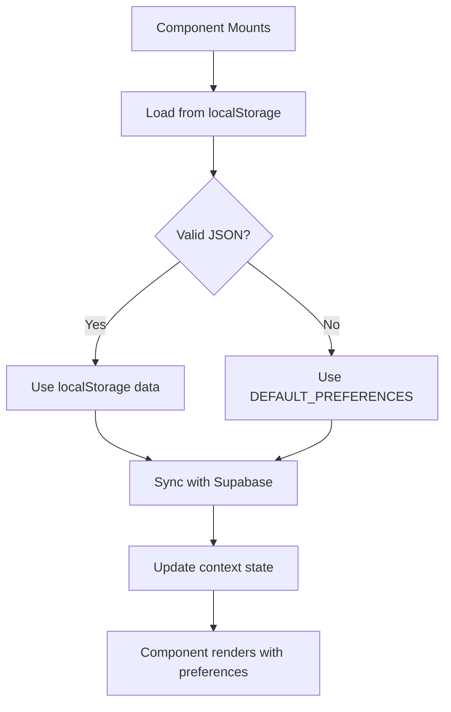
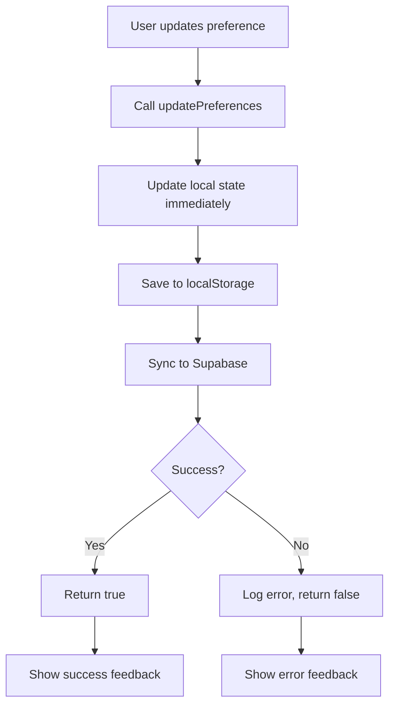

# AgentPreferencesContext Documentation

## Overview

The `AgentPreferencesContext` is a React Context provider that manages AI agent configuration preferences across the DocCraft-AI application. It provides a centralized state management solution for user preferences like tone, genre, memory settings, and copilot behavior.

### What It Controls

The context manages the following agent preferences:

- **Tone**: AI communication style (`friendly`, `formal`, `concise`)
- **Genre**: Primary content type (`Adventure`, `Essay`, `Romance`, etc.)
- **Memory**: Conversation context retention (`enabled`/`disabled`)
- **Copilot**: Proactive suggestion behavior (`enabled`/`disabled`)
- **Language**: Interface language preference (`en`, `es`, `fr`, etc.)
- **Command View Mode**: UI layout preference (`list`/`grid`)

## Implementation

### Context Structure

```typescript
interface AgentPreferences {
  tone: AgentTone;
  genre: string;
  memory: boolean;
  copilot: boolean;
  language: SupportedLanguage;
  commandViewMode: CommandViewMode;
}

interface AgentPreferencesContextType {
  preferences: AgentPreferences;
  updatePreferences: (updates: Partial<AgentPreferences>) => Promise<boolean>;
  resetToDefaults: () => Promise<void>;
  isFieldLocked: (field: keyof AgentPreferences) => boolean;
  isLoading: boolean;
  error: string | null;
}
```

### Provider Implementation

```typescript
export function AgentPreferencesProvider({ children }: { children: React.ReactNode }) {
  const [preferences, setPreferences] = useState<AgentPreferences>(DEFAULT_PREFERENCES);
  const [isLoading, setIsLoading] = useState(true);
  const [error, setError] = useState<string | null>(null);

  // Load initial preferences from localStorage/Supabase
  useEffect(() => {
    const loadPreferences = async () => {
      try {
        const initialPrefs = await loadInitialPrefs();
        setPreferences(initialPrefs);
      } catch (err) {
        setError('Failed to load preferences');
        console.error('Preference loading error:', err);
      } finally {
        setIsLoading(false);
      }
    };

    loadPreferences();
  }, []);

  // Sync preferences with Supabase
  useEffect(() => {
    if (!isLoading) {
      syncPromptBehavior(preferences);
    }
  }, [preferences, isLoading]);

  const updatePreferences = useCallback(async (updates: Partial<AgentPreferences>) => {
    const newPreferences = { ...preferences, ...updates };
    setPreferences(newPreferences);
    
    try {
      await setUserPreferences(newPreferences);
      return true;
    } catch (error) {
      console.error('Failed to update preferences:', error);
      return false;
    }
  }, [preferences]);

  const resetToDefaults = useCallback(async () => {
    setPreferences(DEFAULT_PREFERENCES);
    try {
      await setUserPreferences(DEFAULT_PREFERENCES);
    } catch (error) {
      console.error('Failed to reset preferences:', error);
    }
  }, []);

  const isFieldLocked = useCallback((field: keyof AgentPreferences) => {
    // MCP role-based field locking
    return !mcp.allowedActions.includes('updatePrefs') || 
           adminLockedFields.includes(field);
  }, []);

  return (
    <AgentPreferencesContext.Provider value={{
      preferences,
      updatePreferences,
      resetToDefaults,
      isFieldLocked,
      isLoading,
      error
    }}>
      {children}
    </AgentPreferencesContext.Provider>
  );
}
```

## Usage Examples

### Basic Component Usage

```typescript
import { useAgentPreferences } from '../contexts/AgentPreferencesContext';

function MyComponent() {
  const { preferences, updatePreferences, isLoading } = useAgentPreferences();

  const handleToneChange = async (newTone: AgentTone) => {
    const success = await updatePreferences({ tone: newTone });
    if (success) {
      console.log('Tone updated successfully');
    } else {
      console.error('Failed to update tone');
    }
  };

  if (isLoading) {
    return <div>Loading preferences...</div>;
  }

  return (
    <div>
      <h2>Current Tone: {preferences.tone}</h2>
      <button onClick={() => handleToneChange('friendly')}>
        Set to Friendly
      </button>
    </div>
  );
}
```

### Advanced Component with Field Locking

```typescript
function AdvancedPreferencesPanel() {
  const { 
    preferences, 
    updatePreferences, 
    isFieldLocked,
    resetToDefaults 
  } = useAgentPreferences();

  const handlePreferenceUpdate = async (field: keyof AgentPreferences, value: any) => {
    if (isFieldLocked(field)) {
      console.warn(`Field ${field} is locked by admin policy`);
      return;
    }

    const success = await updatePreferences({ [field]: value });
    if (success) {
      // Show success feedback
    } else {
      // Show error feedback
    }
  };

  return (
    <div className="preferences-panel">
      <div className="preference-item">
        <label>Tone</label>
        <select 
          value={preferences.tone}
          onChange={(e) => handlePreferenceUpdate('tone', e.target.value)}
          disabled={isFieldLocked('tone')}
        >
          <option value="friendly">Friendly</option>
          <option value="formal">Formal</option>
          <option value="concise">Concise</option>
        </select>
        {isFieldLocked('tone') && (
          <span className="locked-indicator">🔒 Locked</span>
        )}
      </div>

      <button onClick={resetToDefaults}>
        Reset to Defaults
      </button>
    </div>
  );
}
```

## Preference Merging and Sync Behavior

### Initial Load Process



### Update Flow



### Sync Implementation

```typescript
// In promptBehaviorSync.ts
export async function syncPromptBehavior(localPreferences: AgentPreferences) {
  try {
    // Get user from Supabase auth
    const { data: { user } } = await supabase.auth.getUser();
    
    if (!user) {
      console.warn('No authenticated user for preference sync');
      return;
    }

    // Get remote preferences
    const remotePreferences = await getUserPreferences(user.id);
    
    if (remotePreferences) {
      // Merge remote preferences with local
      const mergedPreferences = {
        ...localPreferences,
        ...remotePreferences
      };
      
      // Update local state
      localStorage.setItem('agentPreferences', JSON.stringify(mergedPreferences));
      
      // Update Supabase with merged preferences
      await setUserPreferences(mergedPreferences);
    } else {
      // No remote preferences, upload local
      await setUserPreferences(localPreferences);
    }
  } catch (error) {
    console.error('Preference sync failed:', error);
    // Continue with local preferences
  }
}
```

## Supabase Integration

### Database Schema

```sql
-- User preferences table
CREATE TABLE user_preferences (
  id UUID PRIMARY KEY DEFAULT gen_random_uuid(),
  user_id UUID REFERENCES auth.users(id) ON DELETE CASCADE,
  preferences JSONB NOT NULL DEFAULT '{}',
  created_at TIMESTAMP WITH TIME ZONE DEFAULT NOW(),
  updated_at TIMESTAMP WITH TIME ZONE DEFAULT NOW(),
  UNIQUE(user_id)
);

-- RLS policies
ALTER TABLE user_preferences ENABLE ROW LEVEL SECURITY;

CREATE POLICY "Users can view own preferences"
  ON user_preferences FOR SELECT
  USING (auth.uid() = user_id);

CREATE POLICY "Users can insert own preferences"
  ON user_preferences FOR INSERT
  WITH CHECK (auth.uid() = user_id);

CREATE POLICY "Users can update own preferences"
  ON user_preferences FOR UPDATE
  USING (auth.uid() = user_id);
```

### Supabase Service Functions

```typescript
// In lib/supabase.ts
export async function setUserPreferences(preferences: AgentPreferences) {
  const { data: { user } } = await supabase.auth.getUser();
  
  if (!user) {
    throw new Error('No authenticated user');
  }

  const { error } = await supabase
    .from('user_preferences')
    .upsert({
      user_id: user.id,
      preferences: preferences,
      updated_at: new Date().toISOString()
    });

  if (error) {
    throw new Error(`Failed to save preferences: ${error.message}`);
  }
}

export async function getUserPreferences(userId: string): Promise<AgentPreferences | null> {
  const { data, error } = await supabase
    .from('user_preferences')
    .select('preferences')
    .eq('user_id', userId)
    .single();

  if (error) {
    console.error('Failed to get user preferences:', error);
    return null;
  }

  return data?.preferences || null;
}
```

## Security and MCP Integration

### MCP Role-Based Access Control

```typescript
// MCP context integration
const mcp = useMCP();

const isFieldLocked = useCallback((field: keyof AgentPreferences) => {
  // Check MCP permissions
  if (!mcp.allowedActions.includes('updatePrefs')) {
    return true; // All fields locked
  }
  
  // Check admin-locked fields
  if (adminLockedFields.includes(field)) {
    return true;
  }
  
  // Check role-specific restrictions
  if (mcp.role === 'viewer' && field !== 'commandViewMode') {
    return true;
  }
  
  return false;
}, [mcp]);
```

### Fallback Behavior

```typescript
// Default preferences when everything fails
const DEFAULT_PREFERENCES: AgentPreferences = {
  tone: 'friendly',
  genre: 'General',
  memory: false,
  copilot: false,
  language: 'en',
  commandViewMode: 'list'
};

// Safe preference loading
export async function loadInitialPrefs(): Promise<AgentPreferences> {
  try {
    // Try localStorage first
    const stored = localStorage.getItem('agentPreferences');
    if (stored) {
      const parsed = JSON.parse(stored);
      if (isValidPreferences(parsed)) {
        return parsed;
      }
    }
    
    // Try Supabase if authenticated
    const { data: { user } } = await supabase.auth.getUser();
    if (user) {
      const remotePrefs = await getUserPreferences(user.id);
      if (remotePrefs) {
        localStorage.setItem('agentPreferences', JSON.stringify(remotePrefs));
        return remotePrefs;
      }
    }
    
    // Fallback to defaults
    return DEFAULT_PREFERENCES;
  } catch (error) {
    console.error('Failed to load preferences:', error);
    return DEFAULT_PREFERENCES;
  }
}
```

### Validation Functions

```typescript
function isValidPreferences(prefs: any): prefs is AgentPreferences {
  return (
    typeof prefs === 'object' &&
    typeof prefs.tone === 'string' &&
    typeof prefs.genre === 'string' &&
    typeof prefs.memory === 'boolean' &&
    typeof prefs.copilot === 'boolean' &&
    typeof prefs.language === 'string' &&
    typeof prefs.commandViewMode === 'string'
  );
}
```

## Error Handling

### Graceful Degradation

```typescript
// Component error boundary
function PreferencesErrorBoundary({ children }: { children: React.ReactNode }) {
  const [hasError, setHasError] = useState(false);

  if (hasError) {
    return (
      <div className="error-fallback">
        <h3>Preferences Unavailable</h3>
        <p>Using default settings. Please refresh the page.</p>
        <button onClick={() => window.location.reload()}>
          Refresh Page
        </button>
      </div>
    );
  }

  return (
    <ErrorBoundary onError={() => setHasError(true)}>
      {children}
    </ErrorBoundary>
  );
}
```

### Network Error Recovery

```typescript
// Retry logic for failed updates
const updatePreferencesWithRetry = async (updates: Partial<AgentPreferences>, retries = 3) => {
  for (let i = 0; i < retries; i++) {
    try {
      const success = await updatePreferences(updates);
      if (success) return true;
    } catch (error) {
      console.warn(`Update attempt ${i + 1} failed:`, error);
      if (i === retries - 1) throw error;
      await new Promise(resolve => setTimeout(resolve, 1000 * (i + 1)));
    }
  }
  return false;
};
```

## Performance Considerations

### Optimization Strategies

1. **Memoization**: Use `useCallback` for update functions
2. **Debouncing**: Debounce rapid preference changes
3. **Caching**: Cache Supabase responses
4. **Lazy Loading**: Load preferences only when needed

```typescript
// Debounced preference updates
const debouncedUpdate = useMemo(
  () => debounce(updatePreferences, 500),
  [updatePreferences]
);

// Cached preference validation
const isValidPrefs = useMemo(
  () => isValidPreferences(preferences),
  [preferences]
);
```

## Testing

### Unit Tests

```typescript
// __tests__/AgentPreferencesContext.test.tsx
describe('AgentPreferencesContext', () => {
  it('should provide default preferences', () => {
    render(
      <AgentPreferencesProvider>
        <TestComponent />
      </AgentPreferencesProvider>
    );
    
    expect(screen.getByText('friendly')).toBeInTheDocument();
  });

  it('should update preferences successfully', async () => {
    render(
      <AgentPreferencesProvider>
        <TestComponent />
      </AgentPreferencesProvider>
    );
    
    fireEvent.click(screen.getByText('Update Tone'));
    await waitFor(() => {
      expect(screen.getByText('formal')).toBeInTheDocument();
    });
  });
});
```

## Best Practices

### Do's ✅

- Always check `isLoading` before rendering preference-dependent UI
- Use `isFieldLocked()` to respect MCP permissions
- Handle update failures gracefully
- Validate preferences before using them
- Cache preferences locally for offline support

### Don'ts ❌

- Don't assume preferences are always available
- Don't ignore MCP role restrictions
- Don't block UI on preference updates
- Don't store sensitive data in preferences
- Don't forget to handle network errors

## Troubleshooting

### Common Issues

1. **Preferences not loading**: Check localStorage and Supabase auth
2. **Updates not saving**: Verify MCP permissions and network connectivity
3. **Sync conflicts**: Check timestamp-based merging logic
4. **Performance issues**: Implement debouncing and memoization

### Debug Mode

```typescript
// Enable debug logging
const DEBUG_PREFERENCES = process.env.NODE_ENV === 'development';

if (DEBUG_PREFERENCES) {
  console.log('Preferences updated:', preferences);
  console.log('MCP permissions:', mcp.allowedActions);
  console.log('Field locks:', Object.keys(preferences).map(field => ({
    field,
    locked: isFieldLocked(field)
  })));
}
```

---

*This documentation covers the complete implementation and usage of the AgentPreferencesContext. For additional questions or issues, refer to the codebase or create an issue in the repository.* 