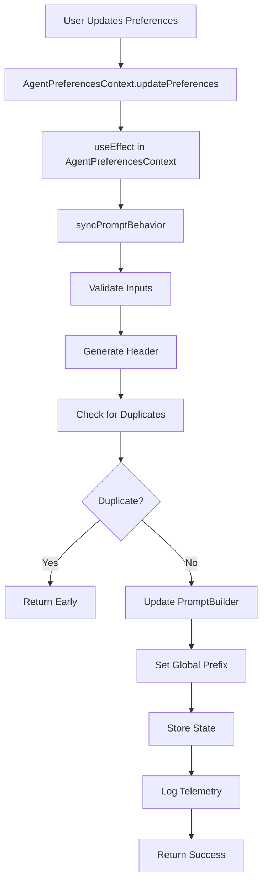

# PromptBehaviorSync Documentation

## Overview

The `promptBehaviorSync.ts` module is responsible for synchronizing AI agent behavior preferences (tone and language) across the DocCraft-AI application. It ensures that prompt headers are consistently injected and updated based on user preferences, while providing robust error handling and fallback mechanisms.

### Purpose

- **Consistent Behavior**: Ensures AI responses maintain consistent tone and language across all interactions
- **Header Injection**: Automatically injects standardized headers into prompts based on current preferences
- **Duplicate Prevention**: Prevents unnecessary re-injections of identical headers
- **Error Recovery**: Gracefully handles failures in PromptBuilder or global context updates
- **Fallback Diagnostics**: Integrates with `logFallbackWarning()` for comprehensive error tracking

### Key Features

- ✅ **Input Validation**: Validates tone and language parameters with fallback to defaults
- ✅ **Duplicate Detection**: Prevents redundant header injections
- ✅ **Error Handling**: Graceful degradation when components fail
- ✅ **Telemetry Integration**: Logs sync events for monitoring
- ✅ **Debug Utilities**: Comprehensive debugging tools for development
- ✅ **Fallback Diagnostics**: Integration with `logFallbackWarning()` for error tracking

## Architecture

### Core Components

```typescript
interface LastInjectedHeader {
  header: string;
  tone: AgentTone;
  language: SupportedLanguage;
  timestamp: number;
}

interface SyncResult {
  header: string;
  injected: boolean;
  tone: AgentTone;
  language: SupportedLanguage;
  reason: 'success' | 'duplicate' | 'promptBuilder_error';
  error?: string;
}
```

### State Management

The module maintains a global `lastInjectedHeader` state to track the most recent header injection. This enables:

- **Duplicate Detection**: Prevents unnecessary re-injections
- **State Inspection**: Allows debugging and monitoring
- **Cache Management**: Provides utilities to clear and reset state

## Call Graph

### Trigger Points



### Integration Points

1. **AgentPreferencesContext**: Triggers sync when preferences change
2. **PromptBuilder**: Receives updated tone and language settings
3. **Global Context**: Sets prompt prefix if available
4. **Telemetry System**: Logs sync events for monitoring
5. **Fallback Diagnostics**: Logs warnings via `logFallbackWarning()`

### Example Usage Flow

```typescript
// 1. User changes tone in UI
const handleToneChange = async (newTone: AgentTone) => {
  await updatePreferences({ tone: newTone });
};

// 2. AgentPreferencesContext triggers sync
useEffect(() => {
  if (!isLoading) {
    syncPromptBehavior(preferences.tone, preferences.language);
  }
}, [preferences, isLoading]);

// 3. syncPromptBehavior executes
const result = syncPromptBehavior('friendly', 'en');
if (result.injected) {
  console.log('Prompt behavior updated successfully');
} else {
  console.log('No injection needed:', result.reason);
}
```

## Edge Cases

### 1. Invalid Input Parameters

**Scenario**: User provides invalid tone or language values
**Handling**: Falls back to defaults and logs warning

```typescript
// Invalid tone provided
const result = syncPromptBehavior('invalid_tone', 'en');
// Result: tone = 'friendly', reason = 'success'
// Warning logged: "Invalid tone 'invalid_tone', using 'friendly'"
```

### 2. PromptBuilder Errors

**Scenario**: PromptBuilder fails to update configuration
**Handling**: Logs error and continues with graceful degradation

```typescript
try {
  promptBuilder.setTone(validatedTone);
  promptBuilder.setLanguage(validatedLanguage);
} catch (error) {
  console.error('Failed to update PromptBuilder:', error);
  logFallbackWarning('promptBehaviorSync', 'promptBuilder', 
    `Failed to update PromptBuilder: ${error.message}`);
  return { /* error result */ };
}
```

### 3. Global Context Unavailability

**Scenario**: Window context or global functions not available
**Handling**: Graceful degradation without breaking sync

```typescript
if (typeof window !== 'undefined' && (window as any).setPromptPrefix) {
  try {
    (window as any).setPromptPrefix(header);
  } catch (error) {
    console.warn('Failed to set global prompt prefix:', error);
    logFallbackWarning('promptBehaviorSync', 'globalPrefix', 
      `Failed to set global prompt prefix: ${error.message}`);
  }
}
```

### 4. Duplicate Injection Attempts

**Scenario**: Same tone/language combination requested multiple times
**Handling**: Early return with duplicate reason

```typescript
const isDuplicate = lastInjectedHeader && 
  lastInjectedHeader.tone === validatedTone && 
  lastInjectedHeader.language === validatedLanguage;

if (isDuplicate) {
  return {
    header,
    injected: false,
    tone: validatedTone,
    language: validatedLanguage,
    reason: 'duplicate'
  };
}
```

### 5. Stale Supabase Values

**Scenario**: Remote preferences are outdated or corrupted
**Handling**: Validation and fallback to local defaults

```typescript
// In AgentPreferencesContext
const loadPreferences = async () => {
  try {
    const remotePrefs = await getUserPreferences(user.id);
    if (remotePrefs && isValidPreferences(remotePrefs)) {
      return remotePrefs;
    }
  } catch (error) {
    console.warn('Failed to load remote preferences:', error);
  }
  return DEFAULT_PREFERENCES;
};
```

## Troubleshooting

### Fallback Detection

The module integrates with `logFallbackWarning()` to provide comprehensive error tracking:

```typescript
// Input validation fallbacks
if (!isValidTone(tone)) {
  logFallbackWarning('promptBehaviorSync', 'tone', 
    `Invalid tone "${tone}", using "friendly"`);
}

if (!isValidLanguage(language)) {
  logFallbackWarning('promptBehaviorSync', 'language', 
    `Invalid language "${language}", using "en"`);
}

// Component error fallbacks
if (error) {
  logFallbackWarning('promptBehaviorSync', 'promptBuilder', 
    `Failed to update PromptBuilder: ${error.message}`);
}
```

### Debug Utilities

```typescript
// Comprehensive debug information
export function debugPromptSync(): void {
  console.group('Prompt Behavior Sync Debug');
  console.log('Last Injected Header:', lastInjectedHeader);
  console.log('PromptBuilder Config:', promptBuilder.getCurrentConfig());
  console.log('Sync Stats:', getSyncStats());
  console.groupEnd();
}

// Check if update is needed
const needsUpdate = needsHeaderUpdate('friendly', 'en');
console.log('Header update needed:', needsUpdate);

// Get current state
const stats = getSyncStats();
console.log('Sync statistics:', stats);
```

### Common Issues and Solutions

#### Issue 1: Headers Not Injecting

**Symptoms**: Prompts don't show tone/language headers
**Diagnosis**: Check if `syncPromptBehavior` is being called
**Solution**: Ensure AgentPreferencesContext is properly triggering sync

```typescript
// Debug check
const result = syncPromptBehavior('friendly', 'en');
console.log('Sync result:', result);
```

#### Issue 2: Duplicate Headers

**Symptoms**: Multiple headers appearing in prompts
**Diagnosis**: Check `isHeaderAlreadyPresent` logic
**Solution**: Clear header cache or check injection logic

```typescript
// Clear cache to force fresh injection
clearHeaderCache();
```

#### Issue 3: Invalid Tone/Language

**Symptoms**: Warnings in console about invalid parameters
**Diagnosis**: Check input validation
**Solution**: Ensure UI is passing valid values

```typescript
// Validate inputs
const validTone = isValidTone(userInput);
const validLanguage = isValidLanguage(userInput);
```

#### Issue 4: PromptBuilder Errors

**Symptoms**: Sync fails with PromptBuilder errors
**Diagnosis**: Check PromptBuilder configuration
**Solution**: Ensure PromptBuilder is properly initialized

```typescript
// Check PromptBuilder state
console.log('PromptBuilder config:', promptBuilder.getCurrentConfig());
```

## Example Test Case

```typescript
// __tests__/promptBehaviorSync.test.ts
describe('promptBehaviorSync', () => {
  beforeEach(() => {
    clearHeaderCache();
  });

  it('should sync valid tone and language', () => {
    const result = syncPromptBehavior('friendly', 'en');
    
    expect(result.injected).toBe(true);
    expect(result.tone).toBe('friendly');
    expect(result.language).toBe('en');
    expect(result.reason).toBe('success');
    expect(result.header).toContain('Tone: friendly');
    expect(result.header).toContain('Language: en');
  });

  it('should handle invalid inputs with fallbacks', () => {
    const result = syncPromptBehavior('invalid_tone', 'invalid_lang');
    
    expect(result.tone).toBe('friendly'); // fallback
    expect(result.language).toBe('en'); // fallback
    expect(result.injected).toBe(true);
  });

  it('should prevent duplicate injections', () => {
    // First injection
    const result1 = syncPromptBehavior('friendly', 'en');
    expect(result1.injected).toBe(true);
    
    // Second injection with same params
    const result2 = syncPromptBehavior('friendly', 'en');
    expect(result2.injected).toBe(false);
    expect(result2.reason).toBe('duplicate');
  });

  it('should handle PromptBuilder errors gracefully', () => {
    // Mock PromptBuilder to throw error
    jest.spyOn(promptBuilder, 'setTone').mockImplementation(() => {
      throw new Error('PromptBuilder error');
    });

    const result = syncPromptBehavior('friendly', 'en');
    
    expect(result.injected).toBe(false);
    expect(result.reason).toBe('promptBuilder_error');
    expect(result.error).toContain('PromptBuilder error');
  });

  it('should integrate with fallback diagnostics', () => {
    const consoleSpy = jest.spyOn(console, 'warn').mockImplementation();
    
    syncPromptBehavior('invalid_tone', 'en');
    
    expect(consoleSpy).toHaveBeenCalledWith(
      expect.stringContaining('Invalid tone "invalid_tone"')
    );
  });
});
```

## Performance Considerations

### Optimization Strategies

1. **Duplicate Prevention**: Avoids unnecessary re-injections
2. **Lazy Validation**: Only validates when needed
3. **Cached Headers**: Stores last injection for comparison
4. **Graceful Degradation**: Continues operation despite component failures

### Memory Management

```typescript
// Clear cache when switching contexts
export function clearHeaderCache(): void {
  lastInjectedHeader = null;
}

// Get statistics for monitoring
export function getSyncStats(): {
  lastHeader: string | null;
  lastUpdate: number | null;
  totalInjected: number;
} {
  return {
    lastHeader: lastInjectedHeader?.header || null,
    lastUpdate: lastInjectedHeader?.timestamp || null,
    totalInjected: lastInjectedHeader ? 1 : 0
  };
}
```

## Security Considerations

### Input Validation

- All inputs are validated before use
- Invalid inputs fall back to safe defaults
- No sensitive data is logged in warnings

### Error Handling

- Errors are logged but don't break the application
- Sensitive information is not exposed in error messages
- Graceful degradation ensures continued operation

### MCP Integration

- Respects MCP role restrictions
- Logs warnings for debugging without exposing sensitive data
- Integrates with fallback diagnostics for comprehensive monitoring

---

*This documentation provides comprehensive coverage of the promptBehaviorSync module. For additional questions or issues, refer to the codebase or create an issue in the repository.* 